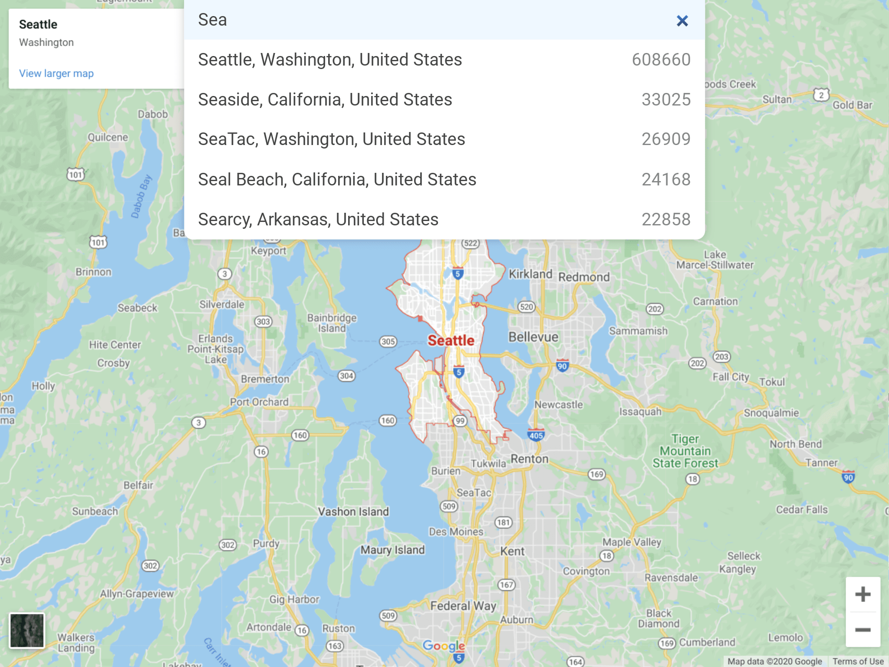
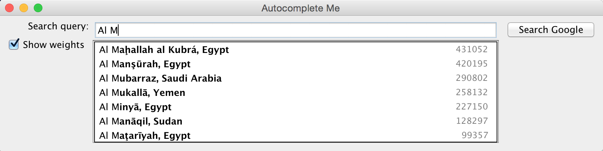

Welcome to the Nifty Web Apps tutorial: **learn how to build a simple web app for any console-based programming assignment**. All materials are open source on GitHub: [kevinlin1/nifty-web-apps](https://github.com/kevinlin1/nifty-web-apps).

*[IDE]: Integrated Development Environment

In this tutorial, we'll **use, modify, and create** ([Lytle et al. 2019](https://doi.org/10.1145/3304221.3319786)) simple web apps that take a string query and return a list of results. We offer the tutorial in two programming languages: Python and Java.

Autocorrect
: Python or Java

Random Sentence Generator ([Zelenski 1999](http://www-cs-faculty.stanford.edu/~zelenski/rsg/))
: Python or Java

Autocomplete ([Wayne 2016](http://nifty.stanford.edu/2016/wayne-autocomplete-me/))
: Python or Java

Deploy your app for free
: [Python](deploy/python.md) or [Java](deploy/java.md)

The [Autocomplete web app](https://autocomplete-me.herokuapp.com/) takes a string prefix and displays the list of matches on top of Google Maps. Compare it to the console input/output and desktop GUI app.

*[GUI]: Graphical User Interface

Web app
: 

Console input/output
: ```
  Query: Sea
  608660 Seattle, Washington, United States
  33025 Seaside, California, United States
  26909 SeaTac, Washington, United States
  24168 Seal Beach, California, United States
  22858 Searcy, Arkansas, United States

  Query:
  ```

Desktop GUI (Java Swing)
: 
